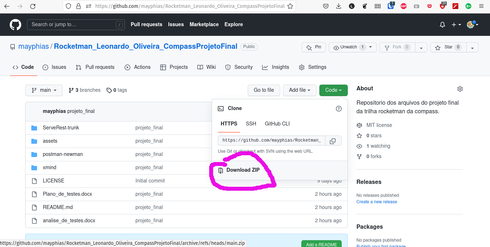
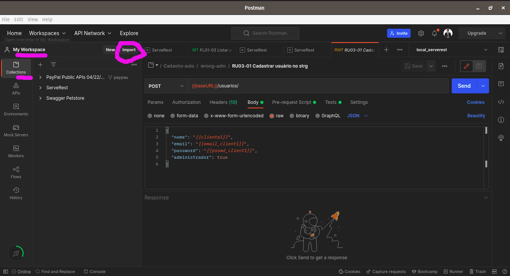

# Rocketman_Leonardo_Oliveira_Compass
# __Projeto final da trilha RocketMan Compass.Uol__

## Apresentação:

Nós arquivos aqui presentes se encontram um plano de testes para a API [ServeRest](https://serverest.dev/), os arquivos export do Postman para a execução dos testes no documento anterior detalhados, os resultados dos testes e a analise dos testes feitos.


[](https://github.com/mayphias/Rocketman_Leonardo_Oliveira_CompassProjetoFinal/blob/main/LICENSE) 


## Pré requisitos

* [**Nodejs e NPM**](https://nodejs.org/en/download/)

* **[Newman](https://www.npmjs.com/package/newman) e/ou [Postman](https://www.postman.com/)**

Siga a instalação dos pacotes Nodejs e NPM para seu sistema operacional, para windows baixe .exe no link posto acima.
Para Linux baixe Nojejs via repositório no terminal, exemplo:
```bash
sudo apt-get install nodejs
```
A instalação de Newman e/ou Postman é opcional já que Postman pode rodar na nuvem.
Para instalar o Newman após a instalação do nodejs, abra o terminal e execute:
```bash
npm install -g newman newman-reporter-html newman-reporter-htmlextra
```
__Talvez seja preciso permissão de administrador__

## Execução dos testes

Para a execução dos testes e obter os mesmos resultados mostrados na analise de testes, baixe os arquivos contidos neste repositorio.



Descompacte os arquivos, abra a pasta __ServeRest-trunk__, abra um terminal nesta pasta.
Para navegar entre pastas no terminal use:
```bash
cd /exemplo/ServeRest-trunk
```
No terminal na pasta do ServeRest-trunk execute o comando:
```bash
npm start
```
Esse comando iniciará o servidor teste local com todas as condições iniciais necessárias para o teste prontas.

### __Para a execução dos testes no Postman__

Importe os testes e ambiente de testes presentes na pasta /postman-newman
Preste ateção nos locais marcados em rosa.
* local_serverest.postman_enviroment.json
* ServeRest_full_tests.json



Selecione a pasta especifica que deseja rodar, ou o conjunto por pasta e o número de interações:


### __Para a execução dos testes no Newman__

Abra um segundo terminal na pasta /postman-newman e execute o seguinte comando:
```bash
newman run ServeRest_full_tests.json -e local_serverest.postman_enviroment.json -n 5 -r htmlextra
```
O resultado do seu teste estará presente na pasta newman, para visualizar os resultados abra o arquivo html no seu navegador.


### Break down das pastas presentes neste projeto

Na pasta principal se encontram:
| Arquivos/ou pasta | Seu papel | 
|-------|----------|
|Plano_de_testes.docx | Tecer qual é o plano de testes da API ServeRest e como ele será executado| 
|analise_de_testes.docx | A analise feita após os testes rodados|
|LICENSE| Tipo de licensa de uso dos arquivos aqui presentes|
|README.md | arquivo de descrição e informação sobre o repositório|
|/ServeRest-trunk| Pasta que contém uma cópia do servidor teste Serverest já configurado para os testes|
|/assets| Imagens utilizadas no projeto |
|/postman-newman| Pasta com os arquivos exportados do Postman para importação no mesmo ou utilização no newman|
|/xmind | Pasta com os mapas mentais em arquivos originais e em melhor definição |


## Autores

* **Leonardo da Silva Oliveira** - *04/09/2022* - [Link para a raiz do projeto no git](https://github.com/mayphias/Rocketman_Leonardo_Oliveira_CompassProjetoFinal)

Shoutout para: rafaelcastrocouto -> https://stackoverflow.com/questions/3959211/what-is-the-fastest-factorial-function-in-javascript que parte do código ideia da parte de fatorial da calculadora utilizada no teste foi retirado do comentário dele.


## License

[MIT License](./LICENSE)

## Créditos

* utilizando o template README do programa Rocketman
* Agradeço a equipe da compass.uol por esse momento de aprendizagem em especial todos os Scrum masters que passaram pela nossa turma Rocketman04
* E aos meus colegas de turma que tornaram toda essa esperiência de aprendizagem mais divertida e interativa